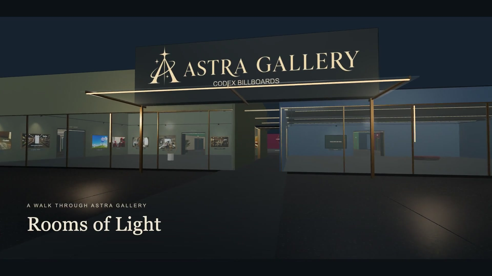
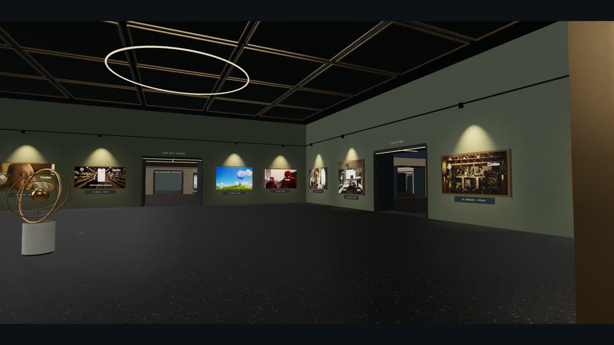
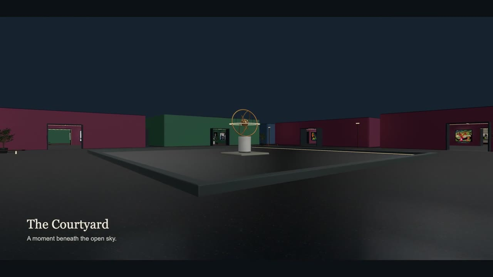
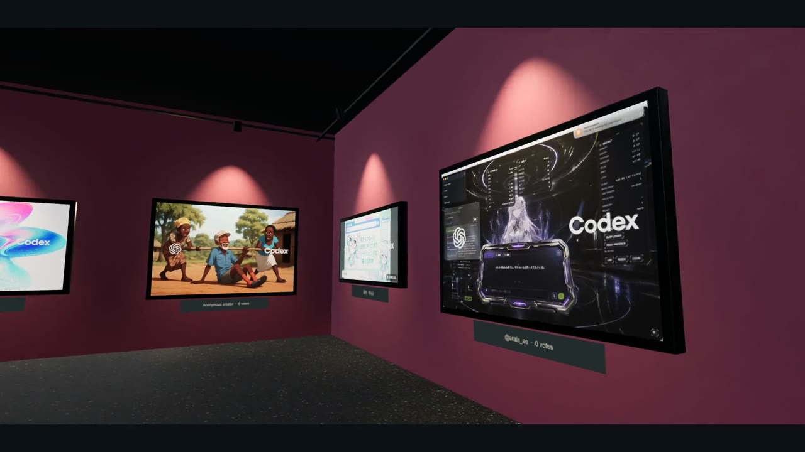

# Astra Gallery

**Codex Billboards, presented as an explorable 3D exhibition.**

[Visit the gallery](https://astra-gallery.lkuczborski.chatgpt.site/) · [Read the making-of article](https://x.com/lkuczborski/status/2099205046604890356) · [Watch the 30-second walkthrough](https://astra-gallery.lkuczborski.chatgpt.site/media/astra-gallery-twitter-30s.mp4) · [Original Codex Billboards collection](https://codex-billboard.vercel.app/gallery)



I built Astra Gallery with **Codex and Astra Ultra** to turn a collection of billboards into a place people could explore. I brought the idea and creative direction, walked through each build and kept refining the experience. Codex handled the implementation and contributed collection names, architectural ideas, generated interior assets, AR model preparation and film production.

**Original project:** [Codex Billboards](https://codex-billboard.vercel.app/gallery), created by **[Jess (@itsjessyin)](https://x.com/itsjessyin)**. Astra Gallery presents that community's works as a virtual exhibition and preserves individual creator attribution.

| Artworks | Connected rooms | Interior treatments | AR models |
| :---: | :---: | :---: | :---: |
| **358** | **26** | **6** | **716** |

## Explore

- **358 distinct works**, curated from a September 7, 2026 snapshot of 367 submissions. Nine duplicates were removed; vote counts were preserved without combining them.
- A **Hall of Fame** for the ten most-voted works and five themed collections: Urban Canvas, Beyond the Horizon, Less, but Louder, Chromatic Worlds, and Human / Machine.
- **26 interconnected rooms**, a glass-fronted street entrance, an open courtyard and six interior treatments with dim lighting, warm spotlights and textured materials.
- Creator profile cards, vote labels, full-image viewing, collection browsing and links for sharing individual works.
- An **Open Studio** for trying a personal image on a gallery wall. Uploaded images stay in the visitor's browser.
- **Phone AR** with a framed GLB and USDZ for every work, loaded on demand. Compatible devices can launch WebXR, Android Scene Viewer or Apple Quick Look.
- A two-minute walkthrough film, a 30-second landscape clip and an original score.

## From a collection to an exhibition

My first brief described a place people could visit: framed works, themed rooms, warm spotlights, a Hall of Fame, an open studio and a film. Codex turned that direction into a working gallery. Once I could walk through it, I could point to specific things I wanted to improve.

| What I noticed or asked for | How the gallery changed |
| --- | --- |
| The rooms felt too similar. | Six interior treatments, varied proportions and ceiling heights, different furniture and materials. |
| Changing rooms meant walking all the way back. | A courtyard layout with 45 connecting doorways and passages, forming routes visitors can follow in loops. |
| The gallery needed an arrival experience. | A street entrance with large glass windows and artworks visible from outside. |
| One Hall of Fame work looked unlit. | An investigation into glass shadows and light selection, followed by checks across every room. |
| The film repeated the same movement. | Independent camera movement and gaze, artwork pauses, gentle walking motion and a continuous entrance sequence. |
| Could a visitor put a work on their own wall? | A model-generation pipeline and an on-demand AR viewer for the entire collection. |

I tried to be clear about what I wanted visitors to feel while leaving Codex room to contribute ideas. I chose the gallery's name and the experiences I wanted it to offer; Codex developed the collection names, much of the architecture and the technical solutions. I wrote about that collaboration in the [making-of article](https://x.com/lkuczborski/status/2099205046604890356).

### Curation, including the duplicates

I asked Codex to remove duplicate submissions before arranging the exhibition. Image matching and visual review reduced **367 submissions to 358 distinct works**. Deduplication keeps the highest-voted version of a repeated image without adding its votes to another submission. The Hall of Fame is ranked after that step.

For the other 348 works, I wanted themed collections with the feel of a curated exhibition. Codex grouped them by their strongest visual theme and developed names, subtitles and wall labels to give each collection character. Those curatorial labels are not presented as the artists' original titles.

| Collection | Works | Character |
| --- | ---: | --- |
| Hall of Fame | 10 | The community's ten most-voted distinct works |
| Urban Canvas | 41 | Streets, cities and architectural imagery |
| Beyond the Horizon | 31 | Landscapes, nature and imagined places |
| Less, but Louder | 38 | Minimal compositions and bold graphic ideas |
| Chromatic Worlds | 35 | Colour, illustration and visual experimentation |
| Human / Machine | 203 | People, computers and the culture around making things |

The [curation report](documentation/curation-report.json) and [deduplication decisions](documentation/dedup-decisions.json) preserve the reasoning and source records. Creator handles, available profile bios and vote counts accompany the works.

## Inside the building



I wanted visitors to keep discovering rooms without having to retrace the same corridor. Codex developed a building with **25 exhibition rooms and one Studio**, arranged around a courtyard and reflecting pool. Its room map follows the actual physical layout. Connectivity checks verify that every room remains reachable without relying on a single connecting passage.

Ceiling heights range from **4.6 to 7.4 metres**. Concrete trusses, walnut slats, vaulted garden rooms, burgundy coves and cooler painted spaces change the atmosphere as visitors move between wings. Plaster grain, walnut pores and terrazzo aggregate use tiled surface-detail and roughness maps.

Blender generators produced benches, curved seating, bronze sculpture and trees. One indoor tree contains roughly **1,470 curved leaves**. The star-and-orbit identity was developed through image generation and integrated into both the facade and the interface.

| The courtyard | Chromatic Worlds |
| --- | --- |
|  |  |

*Interior images are stills from the shipped two-minute gallery film.*

### The spotlight mystery

I noticed that work number 10 in the Hall of Fame looked unlit and asked Codex to check the rest of the gallery too. It found two separate problems: transparent glass still cast solid shadows, and a nearby-light selector could prefer a picture across a wall over one in the occupied room. The fixes made the glass behave correctly and gave the visitor's room priority.

The scene uses a pool of **18 spotlights, with three shadow maps**. When a light changes artwork, it fades completely out and spends one rendered frame in darkness before moving. That small detail prevents a flash on the wrong wall.

A separate flicker at doorways came from room and passage floors overlapping in the same plane. The floor geometry now has disjoint footprints. Placement checks also reserve space for the entire frame and caption, with measured minimum clearances of **1.09 m from corners, 0.99 m from doorways and 0.93 m between neighbouring work envelopes**.

## A film with a memory of its lights

The **120-second, 1080p, 24 fps film** renders the gallery scene through Remotion. Its first **48 seconds are one continuous journey** from the street through the Hall of Fame to the courtyard. Five later cuts visit other wings and finish in the Studio.

The camera's movement and gaze are independent: it can keep walking while turning toward a work, slow down, pause and continue. Walking motion stops during holds. The route was checked at **14,401 sample points** for collisions.

One of my favourite details came from an unexpected rendering problem. Remotion can request frames out of order, while the spotlight allocator depends on what happened in earlier frames. Codex solved this by recording the light simulation sequentially, then restoring the correct assignments and intensities for every requested frame. Both films use that recorded lighting history.

The full film was re-rendered after the lighting and floor fixes. The separate **30-second landscape edit** shares the corrected scene and original piano, strings and harp score. Its closing musical resolution is timed to the invitation to step inside.

[Watch the full film](https://astra-gallery.lkuczborski.chatgpt.site/media/astra-gallery-film.mp4) · [Watch the short clip](https://astra-gallery.lkuczborski.chatgpt.site/media/astra-gallery-twitter-30s.mp4) · [Film production notes](documentation/film-production.md) · [Picture and audio edit details](documentation/film-social.md)

## Take a work into your room

I brought another idea to Codex: could someone choose a billboard on their phone and see it framed on their own wall? I asked it to check feasibility and add the feature. Codex researched the platform requirements and built the model-generation pipeline and viewer integration.

Each artwork has a small framed 3D model: a print, a backing and four bronze frame pieces. Its image starts at **one metre along the longest edge**, with a **2 cm border** and **3 cm frame depth**. Visitors can resize it.

| Route | Asset | Placement |
| --- | --- | --- |
| WebXR / Android Scene Viewer | Self-contained GLB | Wall-oriented AR through the viewer |
| Apple Quick Look | Separately authored USDZ | Vertical-plane anchoring and an export orientation adjustment |
| Desktop or unsupported AR device | GLB preview | Interactive 3D inspection in the browser |

There are **358 model pairs**, approximately **88 MB** altogether. The viewer and a selected work's model load only when the AR preview is opened; visitors do not download the full model library. The largest individual file is under **362 KB**. Hash checks tie every model back to the current artwork image.

The flow is **choose a work → View in your room → Start AR**. Codex validated the model files and 3D previews; I still need to test wall placement on physical iPhones and Android phones. The [AR notes](production/ar/README.md) explain the model format, generation process and validation limits.

The **Open Studio** serves a different purpose: it lets visitors try a personal image under the gallery's lighting and save a screenshot. Uploads stay in the browser, are excluded from the public collection and do not enter the AR model library.

## Making quiet moments cheaper

I also asked for smoother movement and less CPU and GPU work. Codex investigated the renderer and made several changes while preserving the gallery's appearance.

The gallery renders when the camera, light fades or texture blends change. It stops drawing when settled, hidden or covered by a dialog. Static geometry is batched by material within rooms, shadow maps are reused, and movement gradually adjusts resolution toward a 60 fps target.

All **358 low-resolution previews** finish loading before the entrance opens; sharper images fade in nearby. The building stays present as visitors walk, rather than toggling entire rooms at a distance.

In an isolated renderer on an **Apple M5 Pro at 1280 × 720, DPR 1**, street draw calls fell from **1,978 to 1,489**, and Hall of Fame calls from **1,439 to 1,087**—about a quarter fewer in both views. CPU submission improved there, while GPU results varied. These measurements are scoped to that fixture and hardware; they do not promise 60 fps on every phone. The [performance report](documentation/performance.md) includes the full results and tradeoffs.

## Run locally

Use **Node.js 22.13 or newer** and npm.

```sh
git clone https://github.com/lkuczborski/AstraGallery.git
cd AstraGallery
npm ci
npm run dev
```

Open the local URL printed by the development server. The artwork images, models, textures and films are included, so the repository is larger than a typical web starter. No application API key is required for local browsing.

```sh
npm run build
npm start
```

The production build uses Vinext and the Cloudflare Worker runtime; `npm start` serves that build locally through Wrangler. The live gallery is hosted on Sites. `.openai/hosting.json` identifies the original Sites project; use your own project configuration if deploying a separate copy.

## Controls

Drag with the mouse or swipe to look around. Use **WASD** to move, arrow keys to move and turn, and **Shift** to walk faster. Smaller screens offer a touch direction pad. The room map and collection browser provide direct access to rooms and works; **Take a tour** starts the guided visit.

Click a work for its full image and sharing options; hover its label for the creator profile. On a compatible phone, open **View in your room** to start the AR flow.

## Project map

| Path | Contents |
| --- | --- |
| `app/`, `components/` | React interface, collection browsing and artwork dialogs |
| `lib/gallery/` | Three.js renderer, building, layout, navigation, camera route and collection data |
| `public/` | Artwork images, avatars, materials, models, branding, films and music |
| `public/ar/` | 358 GLB/USDZ pairs for framed artwork previews and phone AR |
| `production/` | Blender and AR generators, audio sources and archived Remotion projects |
| `documentation/` | Collection decisions, geometry audits, lighting, performance and production notes |
| `scripts/` | Gallery, layout, lighting, render scheduling and AR integrity checks |

The interface uses **React and Vinext**, the gallery uses **Three.js**, and the AR preview uses a locally hosted **model-viewer** bundle. Blender supplied procedural interior assets; Remotion rendered the films from the gallery scene.

## Checks and production notes

```sh
npx tsc --noEmit
node scripts/verify-gallery.mjs
node scripts/verify-layout.mjs
node scripts/verify-lighting.mjs
node scripts/verify-render-scheduling.mjs
node scripts/verify-ar-assets.mjs
```

The layout check writes a fresh audit to a temporary directory. `npm run lint` also checks the bundled starter component catalog, which has existing lint violations documented in the project notes.

See the [technical overview](documentation/README.md), [performance measurements](documentation/performance.md), [Blender asset notes](production/blender-v2/README.md), [AR generator](production/ar/README.md), [film production](documentation/film-production.md) and [short-film notes](documentation/film-social.md). Some production scripts retain paths from the original workspace; their notes explain the required setup.

The checks cover collection ranking, all artwork viewing positions, navigation and collisions, floor overlaps, spotlight visibility, idle rendering and all 716 AR model hashes. These automated checks complement visual inspection and preserve fixes across later changes.

## Credits and assets

Artwork and creator attribution are recorded in the collection data and shown in the gallery. Third-party artwork and profile imagery remain attributed to their respective creators. Bundled third-party software retains its own notices, including [model-viewer's license and provenance](public/vendor/README.txt). This repository does not grant a blanket license for the exhibited works.
